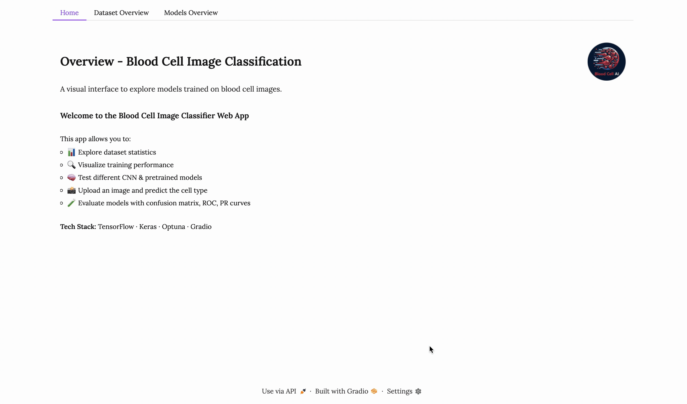

# 🩸 BloodCell AI

## Demo

```<demo gif here>```
<center>

</center>

## 🧠 About the Project

This project was developed as part of a university **Machine Learning** course, where we were challenged to design and implement a **deep learning model** for a meaningful, real-world problem. Our team chose to tackle the automation of **blood cell classification**—an important task in medical diagnostics.

> BloodCell AI leverages convolutional neural networks (CNNs) to accurately classify blood cell types from microscopic images, assisting medical professionals with rapid and reliable diagnostics.

---

## 📊 Dataset

The dataset used in this project comes from publicly available, high-resolution blood smear images, including:

- **Eosinophils**
- **Lymphocytes**
- **Monocytes**
- **Neutrophils**

This data was sourced from a medical imaging dataset used in prior biomedical studies, and represents a broad and cleanly labeled sample of human blood cells.

---

## 🧪 Technologies Used

- **Python** 🐍
- **TensorFlow** & **Keras** – for building, testing and training the deep learning model
- **Optuna** - for Model fine tuning and hyperparameter optimization
- **OpenCV** – for image preprocessing and augmentation
- **Matplotlib / Seaborn** – for data visualization
- **NumPy / Pandas** – for data manipulation
- **Jupyter Notebook** – for development and experimentation

---

## 🧬 Approach

1. **Data Preprocessing**:
   - Image resizing, normalization, and augmentation
   - Label encoding and stratified train/test split

2. **Model Architecture**:
   - Built a **Convolutional Neural Network (CNN)** from scratch
   - Used ReLU activations and MaxPooling layers
   - Final classification through softmax for multi-class prediction

2. **Model Selection**:
   - Comparison of a **Baseline Convolutional Neural Network (CNN)** with a **Benchmark CNN from Kaggle** as well as other Pre-Trained Models from Tensorflow
   - **Transfer Learning** and **fine-tuning** of well performing pre-trained models.
   - Used ReLU activations and MaxPooling layers
   - Final classification through softmax for multi-class prediction

3. **Training & Evaluation**:
   - Optimized using Adam optimizer and categorical cross-entropy loss
   - Hyperparameter Optimization for the most promising models using **Bayesian Optimization** implemented in **Optuna**
   - Achieved high accuracy and generalization on the validation set

4. **Visualization**:
   - Plotted training vs validation accuracy/loss
   - Visualized predictions using confusion matrix and sample outputs

---

## ✅ Results

The trained model was able to:

- Achieve strong **classification performance** with minimal overfitting
- Accurately detect subtle differences between cell types
- Reduce classification time drastically compared to manual analysis

🧪 **Accuracy**: Over 90% on test data  
⏱️ **Time to predict**: ~milliseconds per image

---

## 🚀 Next Steps

We plan to make BloodCell AI more accessible by:

- 🔧 **Building a Streamlit Web App**  
  A user-friendly interface for medical professionals to upload images and get real-time predictions.

- 📦 **Packaging the model** for easy deployment in clinical or educational settings

- 📈 **Enhancing the model** with larger, more diverse datasets and transfer learning

---

## 👨‍🔬 Why It Matters

- Helps accelerate diagnostics in hospitals and clinics  
- Reduces human error and supports overburdened lab staff  
- Makes AI-driven diagnostic tools accessible in remote or under-resourced areas

---

## 📁 File Overview

- `notebooks/BloodCellAI.ipynb` – Full Jupyter Notebook with code, results, and visualizations, this code will later be restructured and organized into classes amd pure python scripts for better documentation. 
- `app/` – Folder for storing the scripts for the Streamlit app.
- `assets/` – Assets folder with models, training data as pickle files, images for the app and the data used to train the models.
- `utils/` - Folder with all the pure python scripts for the backend and modeling.
- `main*.py` - scripts to start the streamlit app or respective TensorFlow training pipelines.
- `README.md` – You’re reading it!

## How to get started

1. Clone the repository:
   ```bash
   git clone <repository_url>
   ```

2. Navigate to the project directory:
   ```bash
   cd BloodCellAI
   ```

3. Install the required dependencies:
   ```bash
   pip install -r requirements.txt
   ```

## How to run the Gradio App

1. To run the Streamlit app:
   ```bash
   python3 run src/app/app_launcher.py
   ```

## How to Train the Models

### A. Running it via the bash script:

1. Adjust file parameter in line ```6``` of the `run.sh` script to set the desired python script:
   ```bash
   python3 src/main_*.py # adjust the * to desired script name
   ```

2. Make the bash script executable:
   ```bash
   chmod +x run.sh
   ```

3. Run the bash script to train all models sequentially:
   ```bash
   ./run.sh
   ```


### B. Running individual training scripts directly:
1. Training the Baseline CNN:
   ```bash
   python3 src/main_baseline.py
   ```

2. Training the Benchmark CNN:
   ```bash
   python3 src/main_benchmark.py
   ```

3. Training Pre-Trained Models with Transfer Learning:
   ```bash
   python3 src/main_pretrained.py
   ```

4. Hyperparameter Optimization with Optuna:
   ```bash
   python3 src/main_optimization.py
   ```

5. List available models and their performance in the `assets/models/` directory.
   ```bash
   python3 src/list_models.py
   ```
